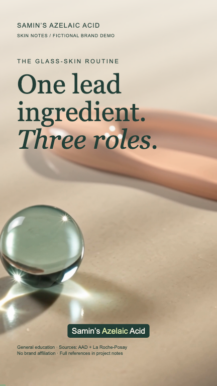

# Samin’s Faceless Shorts Creator

A Codex-driven studio for researched vertical videos, maintained by [Samin](https://github.com/Samin12).

**GPT images through Codex subscription authentication · Higgsfield narration and motion · Remotion editing.**

## Create a video

Open this repository in Codex and ask:

> Make a researched 9:16 educational short for my brand. Generate the images with Codex, the narration and motion with Higgsfield, and render the finished video.

Codex follows `AGENTS.md`. Supply a topic, brand, and reference style when available. Claims are researched before generation; image and audio assets are saved locally for reuse.

## Setup

Install Node 18+, Python 3.10+, FFmpeg, Codex CLI and Higgsfield CLI. Sign into Codex with ChatGPT and into Higgsfield with `higgsfield auth login`. Higgsfield generations use your Higgsfield allowance; they are separate from your Codex subscription. No OpenAI Platform, ElevenLabs, or fal API key is required for the new workflow.

```bash
git clone https://github.com/Samin12/faceless-shorts-creator.git
cd faceless-shorts-creator
cd remotion
npm ci
npm run studio
```

From the repository root:

```bash
# Image generation: prefer Codex’s built-in image tool. CLI alternative:
bash tools/codex_image.sh shorts/skin-trio/image-prompt.txt media/projects/skin-trio/new-textures.png

# Generate audio or a five-second vertical motion clip. Existing outputs are protected.
python3 tools/generate_media.py audio --prompt-file shorts/skin-trio/narration-prompt.txt --out media/projects/skin-trio/new-narration.wav
python3 tools/generate_media.py video --prompt-file shorts/skin-trio/motion-prompt.txt --out media/projects/skin-trio/new-motion.mp4

# Inspect the request without spending credits:
python3 tools/generate_media.py audio --prompt-file shorts/skin-trio/narration-prompt.txt --out /tmp/preview.wav --dry-run
```

## Featured example: Samin’s Azelaic Acid

[Watch or download the finished 53-second video](examples/samins-azelaic-acid.mp4)



**Samin’s Azelaic Acid** is a fictional skincare education brand used for this demo; it is not affiliated with La Roche-Posay. The hook is “The glass-skin routine, explained,” with azelaic acid as the lead ingredient. The short explains azelaic acid, prescription tretinoin, and Cicaplast Baume B5+. It includes an illustrative before/after, realistic expectations, and relevant precautions.

- [Research and claim checks](shorts/skin-trio/research.md)
- [Narration prompt](shorts/skin-trio/narration-prompt.txt)
- [Composition](remotion/src/shots/skin-trio/SkinTrio.tsx)
- Generated assets: `media/projects/skin-trio/`

```bash
cd remotion
npm run gen
npx remotion render src/index.ts SkinTrio ../shorts/skin-trio/output/samins-azelaic-acid.mp4 --concurrency=2
```

Generated assets and the finished demo MP4 are committed. Re-render working files are stored in the ignored output folder. New narration requires updating the verified caption timestamps before rendering. The example uses speech-recognition timestamps, which should be reviewed against the audio.

## Other examples

The original TSX, generative-character, and collage examples remain in `shorts/`, `ai-shorts/`, and `vox-shorts/`. Their historical tools may require their original providers. New work defaults to the Codex/Higgsfield workflow above.

## License and provenance

MIT; see [LICENSE](LICENSE). This adaptation retains the upstream copyright notice and Git history. Original examples and media retain their recorded provenance. Samin maintains this adaptation and its new workflow.
